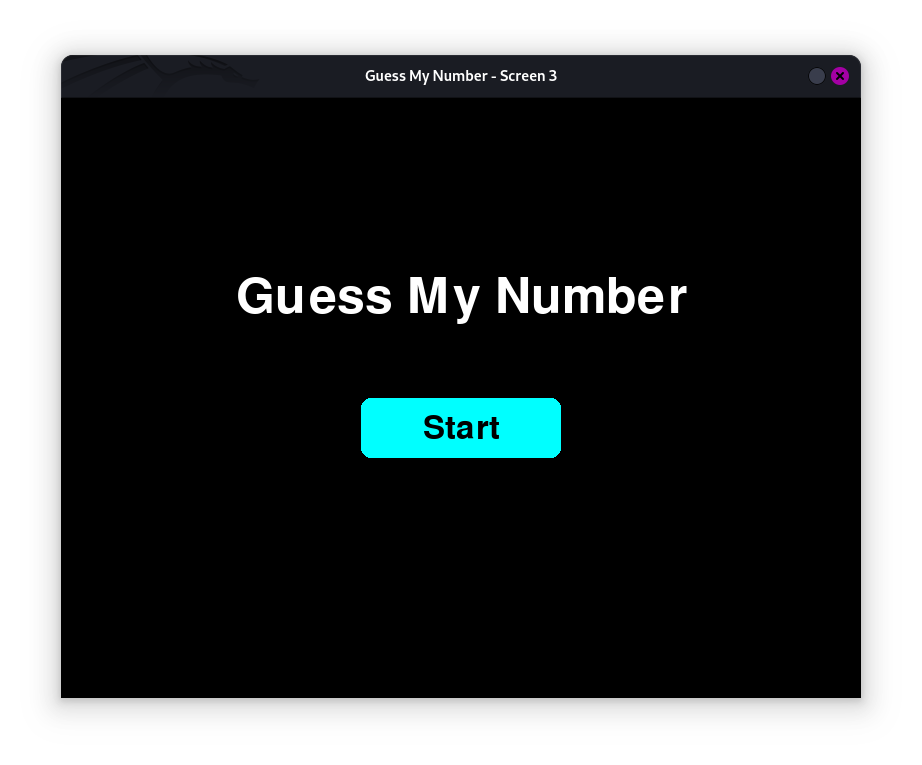
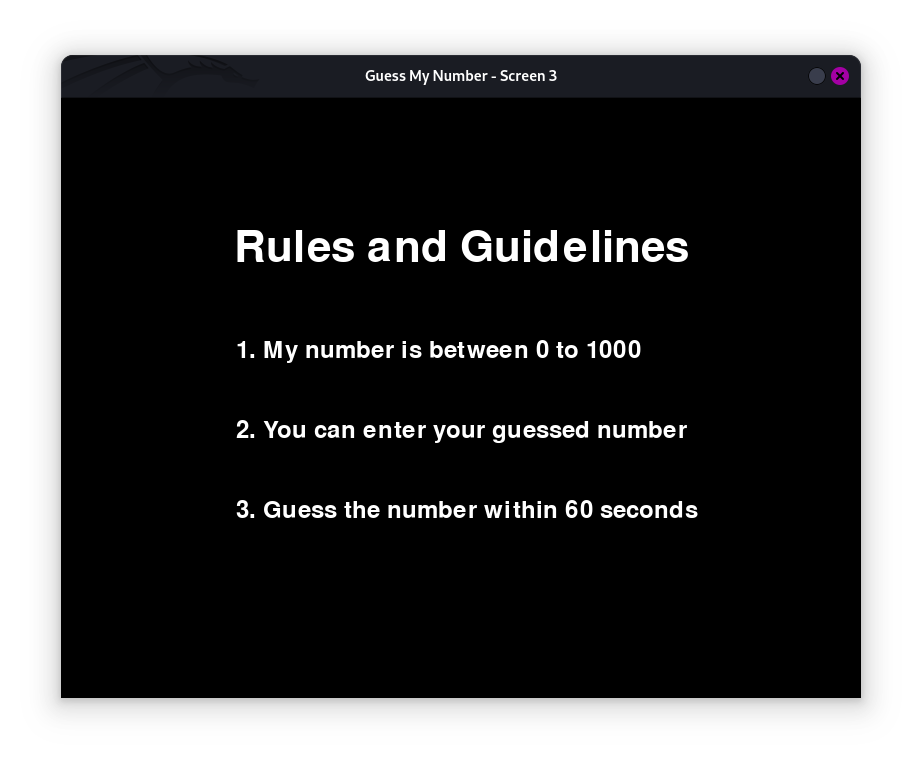
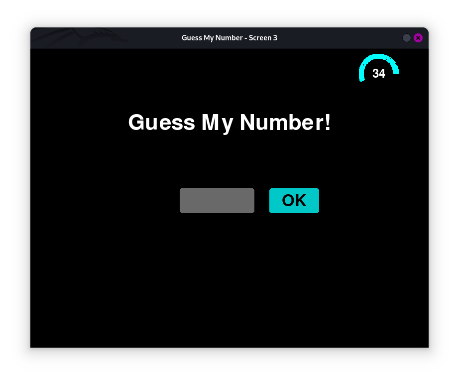

# PRODIGY_SD_02
Software Development Internship of InfoTech Prodigy
[
[Next Task](https://github.com/shamiroxs/PRODIGY_SD_03)
]

---

## Guessing Game 🎮

A fun and interactive number guessing game built with Python and Pygame. This project involves dynamic screen transitions, timed gameplay, and modular design to deliver an engaging user experience.

### Start Screen


### Rules Screen


### Gameplay Screen


---

## Features ✨

- **Three Interactive Screens**:
  - **Start Screen**: Welcomes the player with a clickable start button.
  - **Rules Screen**: Displays the game rules with a fade-out effect after a few seconds.
  - **Gameplay Screen**: A timed guessing challenge with real-time feedback and dynamic UI.

- **Timed Gameplay**:
  - Players have 60 seconds to guess the number.
  - A shrinking pie timer visualizes the time remaining.

- **Pop-ups**:
  - Congratulatory message for correct guesses.
  - Game Over message when time runs out.

- **Modular Design**:
  - Screens are implemented as separate modules (`screen1.py`, `screen2.py`, `screen3.py`) for maintainability.

---

## How to Play 🕹️

1. **Start the Game**:
   - Run the `main.py` file.
   - Click "Start" on the first screen.

2. **Understand the Rules**:
   - Read the guidelines on the second screen (shows for 6 seconds).

3. **Guess the Number**:
   - Enter your guess (between 0 and 1000) and click "OK".
   - The game provides feedback:
     - "Too Low" if your guess is less than the target.
     - "Too High" if your guess exceeds the target.

4. **Win or Retry**:
   - Guess the correct number before time runs out to win!
   - If time runs out, restart the game and try again.

---

## Installation 🛠️

1. **Clone the Repository**:
   ```bash
   git clone https://github.com/shamiroxs/PRODIGY_SD_2.git
   cd PRODIGY_SD_2
   ```

2. **Install Dependencies**:
   Ensure Python 3 and Pygame are installed.
   ```bash
   pip install pygame
   ```

3. **Run the Game**:
   ```bash
   python main.py
   ```

---

## Project Structure 📂

```
guessing-game/
│
├── main.py           # Controls screen transitions
├── screen1.py        # Start Screen module
├── screen2.py        # Rules Screen module
├── screen3.py        # Gameplay Screen module
├── start.png         # Screenshot of Start Screen
├── rule.png          # Screenshot of Rules Screen
├── game.png          # Screenshot of Gameplay Screen
├── README.md         # Project Documentation
```

---

## Knowledge Gained 🧠

This project helped me enhance my understanding of:
- **Pygame Development**: Screen rendering, transitions, and user interaction.
- **Modular Programming**: Creating reusable and organized code components.
- **Game Design**: Implementing timed gameplay and feedback mechanisms.

---

## License 📜

This project is licensed under the MIT License. Feel free to use, modify, and share!
